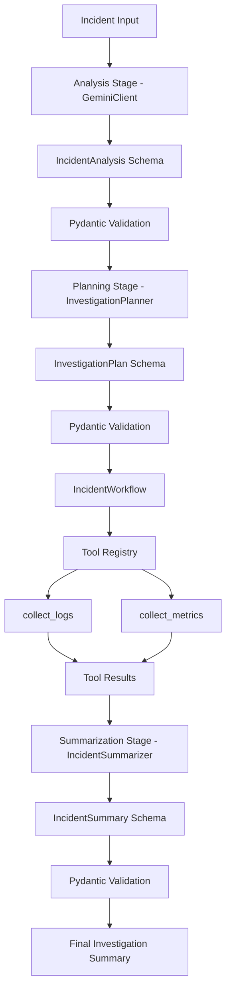

# Watchtower

**An orchestration-first AI incident investigation system** built with raw Python + Gemini SDK.

A deliberate exercise in real-world GenAI systems engineering — inspired by [Anthropic's guide to building effective agents](https://www.anthropic.com/engineering/building-effective-agents).

---

## Engineering Philosophy

Watchtower follows a **workflow-first architecture**.

> **LLMs generate reasoning. Software systems control execution.**

The LLM is treated as one subsystem inside a larger orchestration runtime — not as the runtime itself. This means:

- Composable workflows over unnecessary autonomy
- Explicit orchestration over hidden framework abstraction
- Typed runtime state
- Deterministic execution
- Structured intermediate state
- Validation-first design
- Provider abstraction
- Observability-oriented architecture

---

## Architecture



---

## Features

### LLM Layer
- Gemini SDK integration via raw provider SDK
- Provider abstraction layer (`GeminiClient`)
- Structured generation pipeline

### Schema & Validation Layer
- Typed orchestration state using Pydantic
- Runtime schema validation
- Structured intermediate workflow state

### Workflow Layer
- Multi-stage orchestration pipeline
- Prompt chaining workflows
- Planning-based execution
- Tool orchestration
- Feedback-driven summarization
- Parallel workflow architecture concepts

### Tool Layer
- Dynamic tool registry
- Tool execution runtime
- Controlled execution environment

---

## Workflow Stages

### 1. Incident Analysis

Transforms unstructured incident text into validated structured state.

**Input:**
```
"API latency increased after deployment and error rates are rising rapidly."
```

**Output:**
```json
{
  "issue_type": "Performance Degradation",
  "severity": "Critical",
  "needs_logs": true,
  "needs_metrics": true,
  "summary": "API latency increased and error rates are rising rapidly after deployment."
}
```

### 2. Investigation Planning

The LLM generates a structured execution plan.

```json
{
  "steps": ["collect_logs", "collect_metrics"],
  "reasoning": "Latency and error spikes require logs and metrics investigation."
}
```

### 3. Tool Execution

Python orchestrates deterministic tool execution using a controlled tool registry.

Current tools: `collect_logs`, `collect_metrics`

### 4. Final Summarization

The LLM receives tool results and generates a structured final summary.

```json
{
  "root_cause": "Likely deployment-related performance regression",
  "recommended_action": "Inspect deployment changes and compare metrics before and after deployment",
  "confidence": "medium"
}
```

---

## Tech Stack

| Layer | Technology |
|---|---|
| Language | Python 3.13+ |
| API Framework | FastAPI |
| LLM Provider | Google Gemini SDK |
| Validation | Pydantic + Pydantic Settings |
| Package Manager | uv |

---

## Project Structure

```
watchtower/
│
├── app/
│   ├── agents/
│   │   └── runtime.py
│   │
│   ├── core/
│   │   └── config.py
│   │
│   ├── llm/
│   │   └── client.py
│   │
│   ├── workflows/
│   │   ├── planner.py
│   │   ├── summarizer.py
│   │   └── incident_workflow.py
│   │
│   ├── schemas/
│   │   ├── incident.py
│   │   ├── plan.py
│   │   └── summary.py
│   │
│   ├── tools.py
│   └── main.py
│
├── .env
├── pyproject.toml
└── README.md
```

---

## Setup

**Clone the repository:**
```bash
git clone <repo-url>
cd watchtower
```

**Create and activate a virtual environment:**
```bash
uv venv
source .venv/bin/activate        # macOS/Linux
.venv\Scripts\Activate.ps1       # Windows PowerShell
```

**Install dependencies:**
```bash
uv sync
```

**Configure environment variables** — create a `.env` file at the project root:
```
GEMINI_API_KEY=your_api_key
```

**Run:**
```bash
uv run python -m app.main
```

---

## Example Output

```
ANALYSIS:
issue_type='Performance Degradation'
severity='Critical'

PLAN:
steps=['collect_logs', 'collect_metrics']

RESULT:
Collected logs and metrics

SUMMARY:
Likely deployment-related regression
```

---

## Architectural Patterns

- Augmented LLM systems
- Routing workflows
- Prompt chaining workflows
- Parallel workflow architecture concepts
- Tool orchestration
- Feedback-driven reasoning
- Structured intermediate state
- Typed orchestration pipelines
---

## Roadmap

...

## Architectural Learnings

This project focuses heavily on understanding the architecture beneath modern AI frameworks.

Core learning areas include:

- LLM orchestration pipelines
- Workflow decomposition
- Structured state transitions
- Prompt chaining
- Tool-driven reasoning systems
- Feedback loops
- Deterministic execution layers
- Backend-oriented AI systems engineering

The project intentionally prioritizes architectural understanding over framework abstraction.

## Status

Early-stage orchestration runtime prototype...