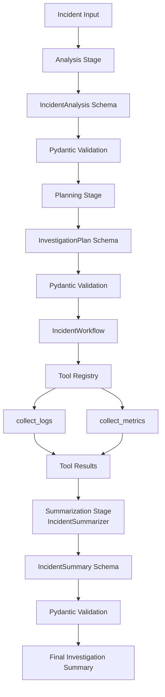

# Watchtower

**An orchestration-first AI incident investigation system** built with raw Python and the Gemini SDK.

A deliberate exercise in real-world GenAI systems engineering — inspired by [Anthropic's guide to building effective agents](https://www.anthropic.com/engineering/building-effective-agents).

---

## Engineering Philosophy

Watchtower follows a **workflow-first architecture**.

> **LLMs generate reasoning. Software systems control execution.**

The LLM is treated as one subsystem inside a larger orchestration runtime — not as the runtime itself.

| Principle | What it means in practice |
|---|---|
| Composable workflows | Stages are independently testable and reusable |
| Explicit orchestration | No hidden framework magic — control flow lives in Python |
| Typed runtime state | Every stage transition goes through Pydantic validation |
| Deterministic execution | Tool execution is Python-controlled, not LLM-controlled |
| Provider abstraction | Workflow layer depends on an `LLMProvider` interface, not a specific SDK |
| Observability-first | Every investigation run carries a trace ID and per-stage timing |

---

## Architecture



---

## Workflow Stages

### 1. Incident Analysis

Transforms unstructured incident text into validated structured state.

**Input:**
```
"API latency increased after deployment and error rates are rising rapidly."
```

**Output:**
```json
{
  "issue_type": "Performance Degradation",
  "severity": "Critical",
  "needs_logs": true,
  "needs_metrics": true,
  "summary": "API latency increased and error rates are rising rapidly after deployment."
}
```

### 2. Investigation Planning

The LLM generates a structured execution plan based on the analysis output.

```json
{
  "steps": ["collect_logs", "collect_metrics"],
  "reasoning": "Latency and error spikes require both logs and metrics investigation."
}
```

### 3. Tool Execution

Python orchestrates deterministic tool execution via a controlled tool registry. The workflow layer decides *when* tools run — the LLM only decides *which* tools are needed.

Current tools: `collect_logs`, `collect_metrics`

### 4. Final Summarization

The LLM receives validated tool results and generates a structured summary with a confidence score.

```json
{
  "root_cause": "Likely deployment-related performance regression",
  "recommended_action": "Inspect deployment changes and compare metrics before and after deployment",
  "confidence": "medium"
}
```

---

## Example Output

```
=== Watchtower Investigation ===
Trace ID: f3a2c1d4-...

[Stage: analysis]        duration=1.2s
  issue_type='Performance Degradation'  severity='Critical'

[Stage: planning]        duration=0.8s
  steps=['collect_logs', 'collect_metrics']

[Stage: tool_execution]  duration=0.3s
  collect_logs    ✓
  collect_metrics ✓

[Stage: summarization]   duration=1.1s
  root_cause='Likely deployment-related regression'
  confidence='medium'
  recommended_action='Inspect deployment changes and compare pre/post metrics'
```

---

## Project Structure

```
watchtower/
│
├── app/
│   ├── agents/
│   │   └── runtime.py          # Orchestration runtime
│   │
│   ├── core/
│   │   └── config.py           # Pydantic Settings config layer
│   │
│   ├── llm/
│   │   └── client.py           # GeminiClient — LLMProvider implementation
│   │
│   ├── workflows/
│   │   ├── planner.py          # InvestigationPlanner
│   │   ├── summarizer.py       # IncidentSummarizer
│   │   └── incident_workflow.py
│   │
│   ├── schemas/
│   │   ├── incident.py         # IncidentAnalysis schema
│   │   ├── plan.py             # InvestigationPlan schema
│   │   └── summary.py          # IncidentSummary schema
│   │
│   ├── tools.py                # Tool registry + execution runtime
│   └── main.py
│
├── .env
├── pyproject.toml
└── README.md
```

---

## Tech Stack

| Layer | Technology |
|---|---|
| Language | Python 3.13+ |
| API Framework | FastAPI |
| LLM Provider | Google Gemini SDK |
| Validation | Pydantic + Pydantic Settings |
| Package Manager | uv |

---

## Setup

**Clone the repository:**
```bash
git clone <repo-url>
cd watchtower
```

**Create and activate a virtual environment:**
```bash
uv venv
source .venv/bin/activate        # macOS/Linux
.venv\Scripts\Activate.ps1       # Windows PowerShell
```

**Install dependencies:**
```bash
uv sync
```

**Configure environment variables** — create a `.env` file at the project root:
```
GEMINI_API_KEY=your_api_key
```

**Run:**
```bash
uv run python -m app.main
```

---

## Architectural Patterns

This project is a deliberate implementation of patterns from the [Anthropic effective agents guide](https://www.anthropic.com/engineering/building-effective-agents):

- **Prompt chaining** — Analysis → Planning → Summarization as discrete, validated stages
- **Routing** — Planning stage routes tool selection based on analysis output
- **Tool orchestration** — Python controls tool execution; LLM only selects which tools to invoke
- **Structured intermediate state** — Typed Pydantic schemas between every stage transition
- **Augmented LLM** — Tool results are fed back into the LLM context for grounded summarization

---

## Roadmap

- [ ] Confidence-gated re-planning loop — if summary confidence is `low`, re-plan and run additional tools
- [ ] Async parallel tool execution via `asyncio.gather`
- [ ] Validation retry with error feedback — failed Pydantic validation is returned to the LLM for correction
- [ ] Structured trace export (JSON) for post-investigation analysis
- [ ] Additional tools: `check_deployment_history`, `query_apm`, `fetch_alert_history`
- [ ] Multi-provider support — `AnthropicClient` implementing the same `LLMProvider` interface

---

## Status

Working prototype. Core pipeline (analysis → planning → tool execution → summarization) is functional end-to-end.